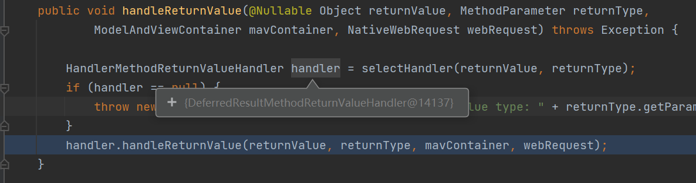

# 通过SpringWeb的DeferredResult实现异步服务的同步化

## 使用场景

大致场景是,后端提供一个查询设备状态的Rest Api.

1) web前端向后端查询设备状态。
2) 后端收到请求之后，通过消息队列向设备发一条指令.
3) 设备从消息队列接收消息后，通过消息队列返回设备状态。
4) 后端向前端返回设备状态。

## 接口使用方式

SpringWeb DeferredResult使用方式

```
    //保存在等待消息的用户请求
    HashMap<String,DeferredResult<DeviceState>> waitMap= new HashMap<>();

    //获取新消息的接口
    @GetMapping("/message")
    public DeferredResult<DeviceState> getState(@RequestParam("requestId") String requestId , @RequestParam("deviceId") String deviceId) {
        DeferredResult<DeviceState> deferredResult = new DeferredResult<>(10 * 1000L);
        waitMap.put(requestId,deferredResult);
        //向设备deviceId发送获取设备状态的请求
        mqClient.send(deviceId, Map.of("command","getstate","requestId",requestId));
        return deferredResult;
    }

    //mq接收线程到设备状态返回消息
    public void onMessage(DeviceState message){
        DeferredResult<DeviceState> deferredResult = waitMap.remove(message.getRquestId());
        if (deferredResult!=null){
            deferredResult.setResult(message);//设置返回结果
        }
    }
```

## Spring的处理过程

### Spring针对DeferredResult的处理入口

在springMvc处理返回值时，在HandlerMethodReturnValueHandlerComposite 中选择类DeferredResultMethodReturnValueHandler 来处理返回参数为DeferredResult的结果处理， DeferredResultMethodReturnValueHandler通过WebAsyncManager 来管理异步请求。

1）DeferredResultMethodReturnValueHandler.handleReturnValue() ,选择业务方法返回参数的处理：



    2）WebAsyncManager中的startDeferredResultProcessing中完成异步处理所需要的超时设置、结果处理器链、超时处理链、异常处理链，以及结果推送类等。


```
 	//在处理方法结果时，启动异步处理。
	public void startDeferredResultProcessing(
			final DeferredResult<?> deferredResult, Object... processingContext) throws Exception {

		Assert.notNull(deferredResult, "DeferredResult must not be null");
		Assert.state(this.asyncWebRequest != null, "AsyncWebRequest must not be null");
		//设置超时
		Long timeout = deferredResult.getTimeoutValue();
		if (timeout != null) {
			this.asyncWebRequest.setTimeout(timeout);
		}

		List<DeferredResultProcessingInterceptor> interceptors = new ArrayList<>();
		interceptors.add(deferredResult.getInterceptor());
		interceptors.addAll(this.deferredResultInterceptors.values());
		interceptors.add(timeoutDeferredResultInterceptor);

		final DeferredResultInterceptorChain interceptorChain = new DeferredResultInterceptorChain(interceptors);
                //向asyncWebRequest注册超时的处理类，通过interceptorChain来处理。
		this.asyncWebRequest.addTimeoutHandler(() -> {
			try {
				interceptorChain.triggerAfterTimeout(this.asyncWebRequest, deferredResult);
			}
			catch (Throwable ex) {
				setConcurrentResultAndDispatch(ex);
			}
		});
		//设置错误处理链
		this.asyncWebRequest.addErrorHandler(ex -> {
			if (!this.errorHandlingInProgress) {
				try {
					if (!interceptorChain.triggerAfterError(this.asyncWebRequest, deferredResult, ex)) {
						return;
					}
					deferredResult.setErrorResult(ex);
				}
				catch (Throwable interceptorEx) {
					setConcurrentResultAndDispatch(interceptorEx);
				}
			}
		});
		//设置结果处理链
		this.asyncWebRequest.addCompletionHandler(()
				-> interceptorChain.triggerAfterCompletion(this.asyncWebRequest, deferredResult));

		interceptorChain.applyBeforeConcurrentHandling(this.asyncWebRequest, deferredResult);
		startAsyncProcessing(processingContext);

		try {
			interceptorChain.applyPreProcess(this.asyncWebRequest, deferredResult);
			deferredResult.setResultHandler(result -> {
				result = interceptorChain.applyPostProcess(this.asyncWebRequest, deferredResult, result);
				//结果推送
				setConcurrentResultAndDispatch(result);
			});
		}
		catch (Throwable ex) {
			setConcurrentResultAndDispatch(ex);
		}
	}
```

### Servlet容器提供的API

针对web请求的异步处理，Servlet向上层Spring提供了主要接口为javax.servlet.AsyncContext。

Spring通过javax.servlet.ServletRequest.startAsync方法从容器获得的异步处理的上下文AsyncContext/AsyncContextState ，容器通过AsyncContext向应用层/Spring提供了超时设置、结果推送的方法。

Jetty的内部通过org.eclipse.jetty.server.HttpChannelState 保存状态变化，控制请求流程。

AsyncContextStatet通过与HttpChannelState交互驱动请求的处理流程。

```
   /*
     * The state of the request processing lifecycle.
     * <pre>
     *       BLOCKING <----> COMPLETING ---> COMPLETED
     *       ^  |  ^            ^
     *      /   |   \           |
     *     |    |    DISPATCH   |
     *     |    |    ^  ^       |
     *     |    v   /   |       |
     *     |  ASYNC -------> COMPLETE
     *     |    |       |       ^
     *     |    v       |       |
     *     |  EXPIRE    |       |
     *      \   |      /        |
     *       \  v     /         |
     *       EXPIRING ----------+
     * </pre>
     */
```

### 关于超时设置

应用在实例化DeferredResult时设置了超时时间timeout
WebAsyncManager在startAsyncProcessing中，通过WebAsyncManager
-> StandardServletAsyncWebRequest.startAsync() -> StandardServletAsyncWebRequest.setTimeout()
->  javax.servlet.AsyncContext.setTimeout  将超时时间传递给servlet容器，由容器来触发超时处理。

其中StandardServletAsyncWebRequest是spring在处理请求时创建的对象，用于保存request和response ，包括与servlet的容器交互。

### 关于超时处理

WebAsyncManager在startDeferredResultProcessingstartAsyncProcessin中实例化了结果处理拦截器链interceptorChain，并在StandardServletAsyncWebRequest设置了超时、结束、错误处理回调，来执行interceptorChain， 容器触发超时后，具体的处理在interceptorChain中处理 ；

### 关于结果处理

WebAsyncManager在startDeferredResultProcessingstartAsyncProcessin中通过DeferredResult.setResultHandler设置结果处理器。

业务调回Spring的DeferredResult.setResult() 设置返回结果时，WebAsyncManager中的interceptorChain进行拦截处理，最后结果通过WebAsyncManager.setConcurrentResultAndDispatch -> StandardServletAsyncWebRequest.dispatch -> AsyncContext.dispatch  将处理结果交付给servlet容器。

AsyncContext是spring通过javax.servlet.ServletRequest.startAsync从容器 获得的异步处理的上下文，容器通过AsyncContext向应用提供了结果分发的dispatch方法

## 其他

    从Idea的调试模式的日志来看， org.eclipse.jetty.server接收请求处理的执行线程、超时处理的线程、设置DeferredResult结果的线程、 处理结果dispatch结果的线程，都是不同的。说明接收请求没有一直占用一个线程。

    相对与在业务代码中用Lock等待结果的方式，这种方式可以避免处理线程被客户端请求持续占用。

## 使用CompletableFuture进一步优化

DeferredResult 通过Web容器实现了在不占用web线程池的情况下处理异步处理请求。但存在两个问题:

1.异步线程回调通知的代码与DeferredResult耦合。

在上面的场景就是，消费消息队列的线程是直接依赖操了DeferredResul，导致整个处理框架缺乏扩展性，例如：现在需要实现一个定时的查询设备状态，与容器的Web请求无关，方案就不适用了。

2.业务逻辑分散，部分结果处理的业务逻辑在异步服务模块中实现。

因为异步服务的模块是直接操作DeferredResult，在设置结果之前需要做的业务逻辑，比如保持结果到数据库，就只能在异步处理模块中完成。

因此在引入DeferredResult实现Web请求异步处理的基础上。增加CompletableFuture实现应用层异步处理的。

大致处理过程如下：

1) Web Controller接收到请求后，构造一个的DeferrendResult、一个随机的请求的reqId，确定结果处理的方法、异常处理方法、超时处理方法 ，通过确定结果处理的方法、异常处理方法、超时处理方法 构造一个CompletableFutrue，将CompletableFutrue和reqId提交给同步服务管理模块SynSvr。
2) SynSvr 将reqId和CompletableFutrue保存在内存中。
3) Web Controller 调用业务处理模块通过消息队列向设备发送请求。
4) 结果接收模块监听结果队列，获得设备的处理结果。
5) 结果接收模块业务处理模块，解析处理结果获得reqId,和执行结果，调用SynSvr。
6) SynSvr根据reqId查找CompletableFutrue，通过complete,触发Web Controller提供的结果处理方法，异常情况，也可以通过completeExceptionally触发异常处理方法。
7) Web Controller 在结果处理方法中进行调用业务代码处理结果，并向DeferrendResult设置web返回结果。

````mermaid
sequenceDiagram
    autonumber
    participant Client
    participant SpringMVC
    Client ->>SpringMVC: getDevcieStatus
    SpringMVC ->> MyController: getDevcieStatus
    MyController ->>MyController: create reqId
    MyController ->>DeferedResult: new
    MyController ->>CallbackFuncton: new (deferedResult)
    MyController -->CompletableFuture: new (callbackFuncton)
    MyController ->> SynSvc: startRequest(reqId,completableFutrue)
    MyController ->> BizService: getDevcieStatus
    BizService   ->> MQ: send  Command
    MQ           ->> Device:  receive Command
    Device       ->> MQ: send result  
    MQ           ->> BizService: receive result
    BizService   ->> SynSvc: onResult
    SynSvc       ->> CompletableFuture: complete
    CompletableFuture ->> ResultFuncton: apply
    ResultFuncton   ->> ResultFuncton: complete(result)


````
